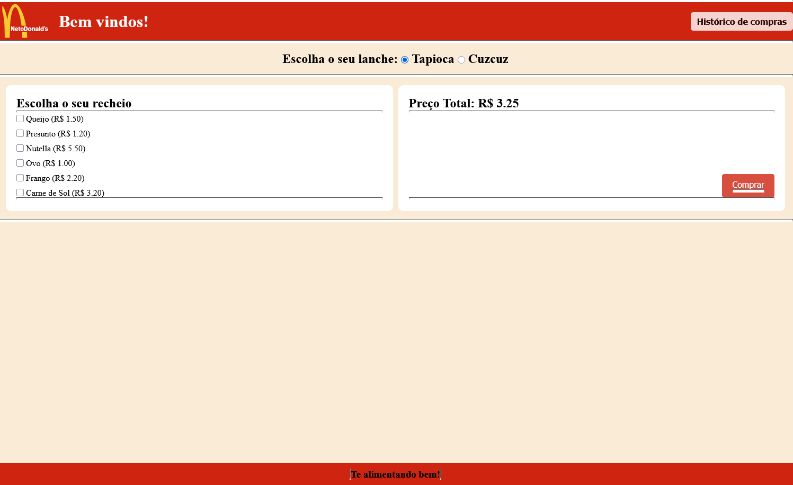
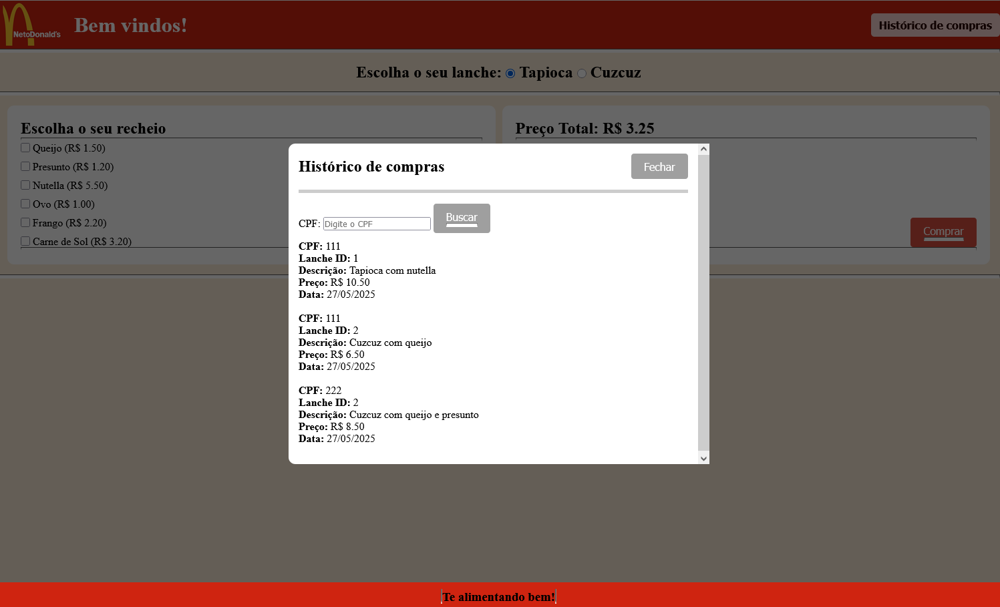
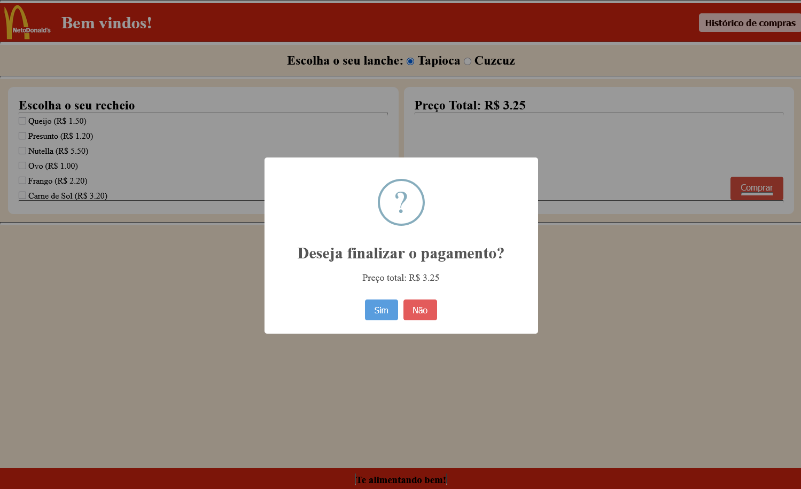
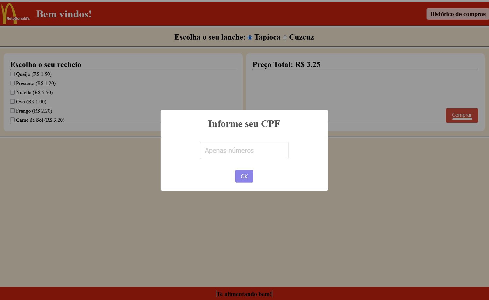

# Projeto NetoDonalds

O projeto consiste em um site de vendas de comidas, dando as opções aos usúarios de escolherem sua comida e recheios. Salvando as informações em um banco de dados.

## Design do projeto

## Scripts utilizados

Utilizado o modal do site sweet alert 2;
https://sweetalert2.github.io/

## Funcionalidades

- [x] Escolher comida, tapioca ou cuzcuz;
- [x] Escolher recheios;
- [x] Calcular preço;
- [x] Ver histórico de compras;
    - [x] Filtra histórico pelo Cpf;
- [x] Comprar e salvar no banco de dados;
    - [] Escolher forma de pagamento;
- [] Responsividade da tela;
- [] Aumentar a quantidade de comidas e recheios;
- [] Melhorar o design;
- [] Melhorar o README;

## Contatos

Email: brunomoreira787@gmail.com